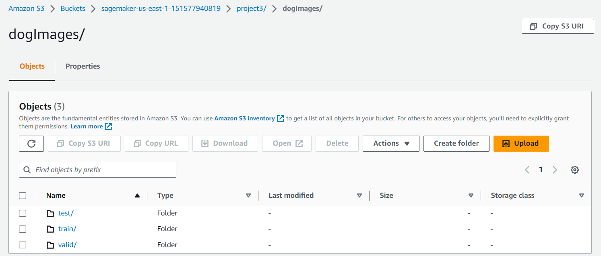
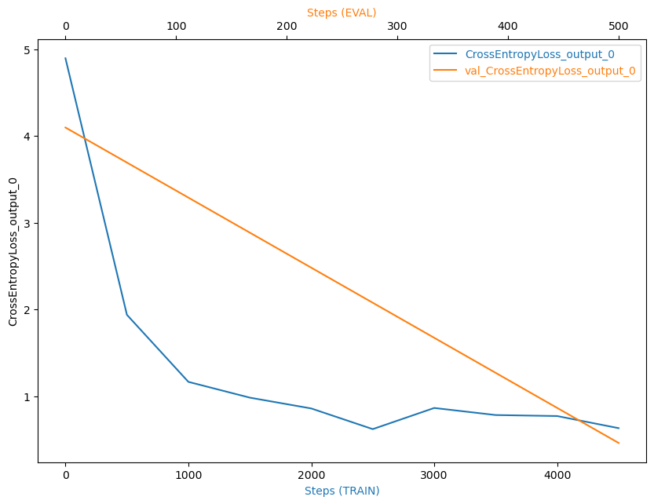
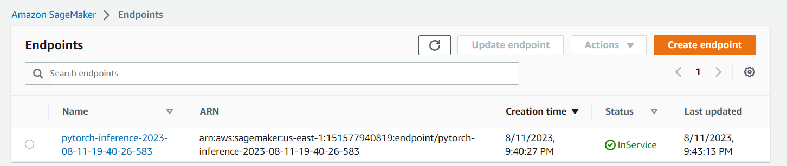

# Image Classification using AWS SageMaker

Use AWS Sagemaker to train a pretrained model that can perform image classification by using the Sagemaker profiling, debugger, hyperparameter tuning and other good ML engineering practices.

Selected dataset: dog breed classication avaiable [here](https://s3-us-west-1.amazonaws.com/udacity-aind/dog-project/dogImages.zip)

Main project file is Notebook: [`train_and_deploy.ipynb`](train_and_deploy.ipynb), which contains an example successful output for each command.

## Project Set Up and Installation
Enter AWS through the gateway in the course and open SageMaker Studio. 
Download the starter files.
Download/Make the dataset available. 

## Dataset
The provided dataset is the dogbreed classification dataset.

Some dataset characteristics:
There are 133 total dog categories.
There are 8351 total dog images.

There are 6680 training dog images.
There are 835 validation dog images.
There are 836 test dog images.

### Access
Upload them to an S3 bucket so that Sagemaker can use them for training (using the notebook).

 

## Hyperparameter Tuning
For hyperparameter tuning, I tried different values for the following hyperparameters:

- model-name: CategoricalParameter(["resnet34", "wide_resnet50_2",
             "resnet18", "resnet50", "resnext101_32x8d",
             "wide_resnet101_2", "shufflenet_v2_x1_0", "resnet152",
             "resnext50_32x4d", "shufflenet_v2_x0_5", "shufflenet_v2_x2_0", "resnet101"])
             
- lr : ContinuousParameter(0.0000001,0.1),
- epochs : IntegerParameter(5,50),
- layers : CategoricalParameter([(n*m)[:-1] for n in [1,2,4] for m in ["256 ","512 ","1028 "]]+[""])

And finally, the best config is:

## Debugging and Profiling

### Debugging

Model debugging in sagemaker is done using the smdebug library which is a part of the sagemaker python sdk. The library provides a set of hooks that can be used to capture the values of tensors at different points in the training process. The library also provides a set of rules that can be used to detect common issues in the training process. 
We used Amazon SageMaker Debugger for debugging the model to check how well the model is training.  
We registered the model by creating a SMDebug hook in the main function and passed this hook to the train and test functions with TRAIN and EVAL mode respectively.  
We also configured the Debugger Rules and Hook Parameters of what should be tracked in the notebook train_and_deploy.ipynb. 
If the debugging output showed an anamlous behaviour, we would have to debug the model and fix the issue. 
This could be done by viewing the cloudwatch logs and adjusting the code appropriately. 

The Graphical representation of the Cross Entropy Loss.

### Profiling

Using Sagemaker Profiler, we monitored Instance metrics, GPU/CPU utilization and GPU/CPU memory utilization.  
To use Sagemaker Profiler we created profiler rules and configurations. The output is a HTML report.  

The profiler report can be found [here](ProfilerReport/profiler-report.html.gz).

## Model Deployment
In order to deploy we need to create additional entrypoint for the network to load and preprocess image. 
These operations are included in `inference.py` that was created by the Notebook [`train_and_deploy.ipynb`](train_and_deploy.ipynb) from `inference_template.py`. 

A screenshot of the deployed active endpoint in Sagemaker.
